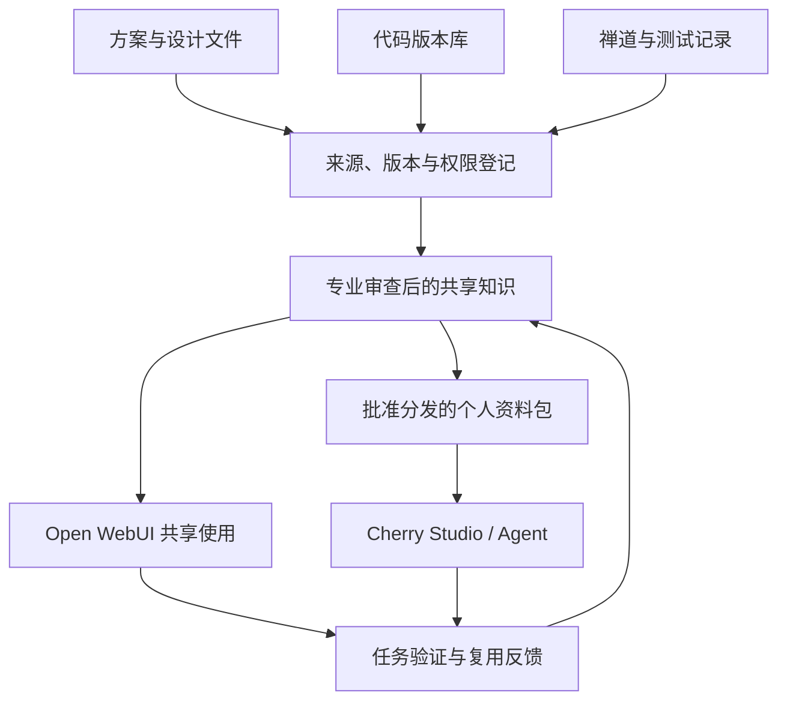

# 部门知识体系建设建议：以经验传承和跨项目复用提升研发效率

日期：2026-10-02  
版本：v0.1  
用途：向部门领导提出独立建设建议。培训是推广和培养使用能力的配套活动，知识体系建设按独立任务组织。

## 一、供领导决策的核心建议

建议以“研发知识沉淀与复用试点”启动部门知识体系建设，选择一个有历史资料、有相似新任务、软硬件与测试人员共同参与的产品方向，优先解决历史方案查找、联调问题复用和测试经验传承。先验证知识能否支撑具体工作，再逐步扩大覆盖。

建设目标是让经过核验的项目经验在新任务中被找到、被理解、被使用，并持续回到部门资产中。AI承担资料整理、检索、比较和草稿生成；专业人员确认事实、适用条件和工程结论。

建议领导先明确四项安排：

1. 指定试点牵头人和四个专业组的知识联络人，明确审查与维护责任。
2. 选定一个试点产品方向和两个任务场景，划定第一批可共享资料范围。
3. 将资料整理、经验复盘、审核和复用反馈计入正常项目工作量，试行按贡献质量与复用效果认可人员。
4. 批准约八周的试点安排，以实际任务结果、质量与总投入形成阶段评估，再决定扩展范围。

上述周期、人员时间和数量是结合当前情况提出的候选安排，尚不是已批准计划或经过实测的绩效承诺。

## 二、部门现状与问题判断

### 2.1 已确认的情况

以下事实来自2026-10-02的部门情况说明：

| 方面 | 当前情况 | 建设含义 |
|---|---|---|
| 目标 | 经验传承、跨项目复用、提高研发效率 | 成效应落实到研发任务和团队能力 |
| 组织 | 硬件开发、软件开发、芯片设计、测试四个专业组 | 专业组承担领域知识质量责任，产品任务需要跨组关联 |
| 工作方式 | 软硬件协作开发，测试进行最终验证 | 首批知识宜覆盖设计依据、接口约束、联调问题和验证结果 |
| 资料 | 技术方案、设计文件分散在个人电脑 | 需要形成可追溯的共享来源和版本 |
| 系统 | 代码在版本库，测试数据在禅道 | 利用已有系统，建立知识与代码、测试记录的关联 |
| AI基础 | 已部署模型和Open WebUI，正在准备AI培训 | 具备使用入口，实际知识效果仍需验证 |
| 组织机制 | 尚无人牵头，参与积极性不高，需要激励 | 领导授权、工作量安排、专业责任和认可机制要同步落实 |
| 使用方式 | 部分资料需统一访问控制；可共享资料可由个人使用Cherry Studio或Agent访问 | 建立共同来源、版本与分发范围，支持多个入口 |

部门人数、各系统的接口与导出能力、可使用的共享存储、具体权限配置及投入上限尚未确定。试点第1周完成确认，不据此推算预算或全量工程规模。

### 2.2 当前主要短板

结合上述事实，当前首先需要补齐三个环节：个人资料进入可维护的部门资产；项目事实转化为可迁移的经验；经验进入新项目的实际工作。缺少牵头和激励，使这些环节没有稳定的责任和时间保障。

“AI应用推广慢”可能同时受任务匹配、模型能力、资料可用性、使用方法及组织安排影响。需要通过试点区分原因，不能预先认定全部由知识库缺失造成。

同样，资料归集只是起点。文档里若没有记录设计选择的理由、故障排除的依据和适用条件，AI无法凭空恢复这些经验。建设过程应包含专家讨论、项目复盘和共同实践。

## 三、理论与实践依据，以及如何适配部门

以下依据分别支持管理体系、知识转化、工作流程和工程复用。它们不能直接证明本部门会提高某个百分比的效率。

| 依据 | 已核查的主要观点或事实 | 对部门的适配建议 | 使用边界 |
|---|---|---|---|
| ISO 30401:2018 知识管理体系标准 [1] | 官方公开说明覆盖体系的建立、实施、维护、评审和改进；页面列出2022与2024修订，并显示新版本处于草案阶段 | 建设方案同时安排目标、职责、运行规则和成效评估 | 以公开说明为依据；未引用付费全文条款，不宣称已满足认证要求 |
| Nonaka组织知识创造理论，1994 [2] | 讨论隐性与显性知识的互动，以及个人知识向组织扩展 | 将工程师经验通过讨论和复盘形成记录，再整理为方法，并在实际工作中学习和改进 | 是解释框架；部分现场判断仍需导师与共同实践 |
| KCS v6，工作过程中捕获知识 [3] | 主张在问题处理过程中记录上下文和处理信息 | 在联调、缺陷分析、设计评审时逐步记录证据，问题关闭时完善经验卡 | 来源主要为服务与支持场景；研发中的正式结论增加专业审查 |
| KCS绩效与认可实践 [4][5] | 提醒活动数量与价值关系有限；认可应对齐实际贡献，启动奖励应有阶段边界 | 承认整理和审核工作量，记录有效复用与纠错，认可个人和团队 | 具体激励办法按部门制度试行与评估 |
| NASA经验教训生命周期 [6] | 包括收集、记录、传播、应用；应用可体现为流程、检查表、手册等的更新 | 将高价值经验转入设计检查表、排障步骤和回归用例 | 借鉴工程组织的做法，不推算本部门收益 |
| GAO对NASA的2002年审计 [7] | 当时已有经验系统，仍存在时间、文化和应用落实障碍；提出领导承诺、实施计划、激励和便利检索等方向 | 领导同时安排责任、时间与认可，追踪经验是否在项目中应用 | 历史案例，其建议已有实施跟踪，不描述为NASA当前问题 |
| 航天研究机构的软件失效学习研究 [8] | 10名工程师访谈及另外5名高可靠性组织人员访谈，报告时间限制、知识流失、文档分散和流程不足等问题 | 复盘与经验应用嵌入研发流程，并记录跨项目使用情况 | 定性案例研究；不能提供知识库提效的因果数值 |

本建议对这些依据作出工程适配：以专业组保证知识质量，以产品和项目保留上下文，以具体工作任务组织使用，以有证据的复用评估成效。下文的分类、模板、周期和指标均为本部门候选设计，不是上述标准或论文规定的统一模型。

## 四、知识如何组织：专业负责、项目关联、任务使用

### 4.1 三个相互关联的组织维度

专业维度用于确定谁负责：硬件、软件、芯片设计和测试领域分别维护自己的标准、方法与经验。

产品与项目维度用于解释在哪些条件下成立：关联产品型号、硬件版本、软件版本、芯片版本、阶段、代码和测试记录。相似问题跨项目复用时，据此判断差异。

任务维度用于让工程师容易使用：例如方案比较、设计评审、接口联调、故障排查、测试用例准备、新人接手。用户从任务进入，系统返回跨专业的相关知识。

同一条知识可以关联多个专业和项目。给它一个稳定编号和权威版本，通过标签和关联形成不同视图，减少多份副本分别维护。

### 4.2 首批建设五类知识资产

| 类型 | 典型内容 | 主要用途与责任 |
|---|---|---|
| 标准与方法 | 接口约定、设计规范、评审检查表、测试方法 | 专业组维护；供设计和检查使用 |
| 项目依据与决策 | 技术方案、设计选择、限制条件、替代方案、验证结论 | 项目负责人组织，专业人员审核；保留决策上下文 |
| 问题与经验 | 故障现象、排查路径、证据、根因、修复、适用条件 | 处理问题的人贡献，相关专业审核；支撑排障与预防 |
| 可复用实现 | 代码模块、脚本、测试用例、参考设计、已验证操作流程 | 维护人确认版本与接口；通过实际验证后复用 |
| 专家与能力目录 | 某类问题的专业联系人、分享材料、导师与交接记录 | 联络人维护；支撑资料不足时找到合适的人 |

图纸和原理图等保留原始设计文件；供AI使用的说明、图片和文本要记录转换来源并检查解析质量。代码以版本库中的版本为准。测试事实以禅道及其关联的原始数据为准。

### 4.3 首批入库最低信息

每项共享资产至少记录：知识编号、标题与类型、产品/项目、适用版本或条件、原文来源与定位、作者及维护人、审核状态、共享范围、更新日期。失效知识增加替代项或失效原因。

建议状态为：草稿、已审查可用、需复核、已失效。正式共享助手优先使用已审查可用的内容；若展示其他状态，必须明确说明状态。共享助手要能够指出缺少证据、版本冲突和不适用条件。

## 五、怎样让经验持续积累

### 5.1 采用简短、带证据的经验卡

经验卡围绕一个可复用问题，先形成结构完整的短记录，复杂证据通过来源链接保留。模板如下：

| 字段 | 要回答的问题 |
|---|---|
| 问题与上下文 | 在什么产品、版本和环境下，出现了什么现象？ |
| 观察与证据 | 有哪些日志、波形、测试或代码事实，原始记录在哪里？ |
| 排查与决策 | 尝试过什么，如何排除其他原因，为什么选这个方案？ |
| 结论可信度 | 已验证根因、暂定解释还是待验证假设？ |
| 处理与验证 | 修改了什么，怎样证明有效，有什么残留问题？ |
| 复用边界 | 什么条件下可参考，哪些版本或场景不能直接套用？ |
| 预防与关联资产 | 应修改哪些检查表、测试用例、脚本或规范？ |
| 管理信息 | 作者、审核人、维护人、版本、共享范围和更新时间 |

AI可协助从已有资料和工程师说明中整理草稿、提出缺项问题、建议标签。采用前需专业人员对照来源确认，尤其是根因、验证结论和适用条件。AI生成的合理解释不能作为已验证结论入库。

### 5.2 在现有研发节点安排小步骤

| 节点 | 建议动作 | 留下的可复用成果 |
|---|---|---|
| 新任务启动 | 查询相似设计、已知问题和验证方法；确认版本差异 | 历史参考清单与差异说明 |
| 设计评审 | 引用相关规范和经验，记录关键取舍 | 决策记录、检查表更新 |
| 联调和排障 | 随过程记录现象、条件与证据；检索相似问题 | 经验卡草稿及证据链接 |
| 重要缺陷关闭 | 完善验证结果、适用范围和预防措施，专业审核 | 已审查经验卡、回归用例 |
| 阶段结束和交接 | 做一次短复盘，检查遗漏与维护人 | 项目知识目录与交接清单 |

试点中可先约定：重大或有重复风险的问题关闭时检查是否需要经验卡；每个关键节点安排约30分钟的跨专业复盘。具体频率由工作量决定，不要求所有琐碎问题另写文档。

知识消费端也承担维护责任。工程师复用后记录在哪项任务使用、是否有效、做了什么调整；发现不准确或过期时反馈或提交修改。复盘同时记录成功的方法和失败的尝试，讨论聚焦技术证据与流程改进。

## 六、平台与数据来源如何分工

### 6.1 先形成可维护的权威来源，再配置使用入口

设计文件先从个人电脑中选出试点范围内的有效版本，归集至部门批准的受控共享位置或文档系统，指定维护人。共享位置具体采用已有文件服务器、文档系统还是适合文本的版本库，在试点第1周确认。

代码保留版本库管理；知识说明链接到指定提交、标签或发布版本。测试数据保留禅道及其原始附件；经验卡关联用例、缺陷、测试结果和相关版本。原始记录更新后，关联知识也要检查适用性。

上图为建设建议，尚未部署。同步、解析和连接方式依实际系统接口选择。初期通过受控导出和手工发布即可验证任务，随后再评估自动同步。

### 6.2 三种使用方式

| 使用入口 | 本部门建议定位 | 需要满足的条件 |
|---|---|---|
| Open WebUI | 部门或项目共享助手，按授权范围查询专业知识和历史项目资料 | 配置知识来源与共享范围，验证引用和访问控制 |
| Cherry Studio | 个人使用已批准共享的资料包、专题整理与探索 | 资料包有发布版本、维护人和更新来源；使用允许的模型服务 |
| Agent | 在授权工作区中结合知识、代码和工具完成分析、脚本或测试任务 | 明确可读取资料、可执行操作和验证要求；受控资源通过用户授权的接口访问 |

Open WebUI官方文档描述了角色、组、功能权限和资源访问控制，并提供知识库检索与文档问答功能。[9][10] 这些是公开能力依据，具体到部门实例的配置和效果仍需验证。

功能权限与资源权限要分开理解：能否创建或管理知识库，与能否读取某个项目资料并不是同一个问题。官方文档说明功能权限采用授予权限的合并逻辑，需检查默认权限和全部组授权。[9] 对知识库、文件、模型绑定和工具接口，应分别验证实际访问效果。

在试点中至少用不同权限账号验证：直接检索、助手回答、引用链接、原文件下载以及使用相关接口时，都遵守共享范围。AI回答使用的片段也要经过授权范围过滤。

“不需要细分权限”可定义为“部门内已批准共享”，不等于允许上传到任意外部服务。个人入口访问同一版本的部门资料，能让个人探索的有用成果继续进入共享体系。

### 6.3 依据知识类型选择处理方式

文本文档和经验卡适合先做检索问答；寄存器名称、错误码、接口号等精确标识需要保留关键词检索能力；代码分析保留仓库搜索与版本信息；表格数据、指标计算和测试统计采用确定性程序或数据库查询；原理图和设计图片需人工检查解析结果。

检索组合、分段、重排及上下文长度通过真实问题集选择。当前已有模型不意味着任意资料格式都能被正确理解，也不意味着全部工具调用已经在知识场景验证通过。

## 七、组织职责与激励机制

### 7.1 最小责任安排

| 角色 | 建议承担的责任 | 初期工作安排建议 |
|---|---|---|
| 部门领导或指定负责人 | 明确目标与优先级，授权共享边界，保障时间，阶段评估 | 定期检查试点结果与障碍 |
| 试点牵头人 | 组织任务、模板、来源目录、试用与效果记录 | 按任务计划核定投入；可以由David先统筹 |
| 四组知识联络人 | 组织资料选择、专业审查，指定每项知识的维护人 | 建议每组明确一名兼职人员，先预留每周约1～2小时 |
| 项目负责人 | 将经验查询与沉淀安排进研发节点，确认跨专业关联 | 纳入既有项目工作 |
| 资产作者与维护人 | 记录、修订和处理复用反馈 | 纳入本人项目工作量 |
| 平台维护人员 | 维护账号、权限、可用性与发布备份 | 利用现有运维安排 |

联络人不必独自审查所有内容，应组织真正熟悉该项技术的人审核。牵头人也不应成为所有知识的唯一编辑和维护人。试点确认负担后调整人员时间。

### 7.2 让参与者看见投入与收益

建议先落实工作量，再开展认可：项目计划中列出整理、审核和复盘时间；保留作者、审核人、纠错者和复用者的贡献记录；月度展示一两个有来源、有使用结果的复用案例。

在部门制度允许范围内，可设置阶段性的优秀经验、有效复用和跨组协作认可，试点结束后评估是否继续。对新人、测试人员、审核者和整理人员都保留参与机会。[5]

正式绩效中的权重和奖金额度需结合部门制度确定。建议以质量、实际使用、纠错和协作为依据，避免用上传量、文章数、聊天次数或点赞数直接换算绩效。[4]

跨项目复用的认可可以同时覆盖原作者、维护审核人员及应用团队。要求有任务记录和独立使用反馈，防止互相刷引用；高价值预防性检查表即使复用次数少，也可通过专业审查评价其作用。

## 八、八周试点如何推进

### 8.1 推荐两个互相关联的场景

**场景A：历史设计方案与接口约束复用。** 在一个相似产品任务中，查找可参考的方案、接口约束和历史决策，形成带来源与版本的差异分析，辅助设计和评审准备。

**场景B：软硬件联调与测试问题复用。** 从已关闭且有验证证据的问题中建立经验卡，在相似问题排查和测试用例准备中使用，验证是否能减少信息查找和无效排查。

优先选择已有较完整材料、未来确有类似任务、参与人员愿意试用的产品方向。硬件、软件和测试构成首批协作团队；芯片设计组参与知识规则与专业审查，后续依据真实需求增设场景。

### 8.2 阶段安排和成果

| 阶段 | 建议工作 | 可检查的成果 |
|---|---|---|
| 第1周：确定范围 | 指定责任人，确定场景与共享范围，盘点来源和可用版本，确认投入 | 一页试点任务书、资料清单、权限和维护责任表 |
| 第2～3周：形成首批资产 | 选取约20～30份相关资料，整理约10～15条经验，专业审核，建立关联 | 已审查资料包、经验卡、代码和测试链接、问题集 |
| 第4周：配置并核验使用 | 建立共享助手与个人资料包，检查版本、引用、无答案及访问效果 | 可重复演示的任务、问题记录与修订清单 |
| 第5～7周：真实任务试用 | 在方案比较、联调和测试准备中使用，记录时间、质量与复用反馈 | 任务结果、使用记录、资产更新记录 |
| 第8周：阶段评估 | 比较增益与维护负担，分析失败原因，确定后续扩展范围 | 领导评估材料、继续或调整的理由、下一阶段责任安排 |

数量用于控制首批范围。资料与经验的实际数量以覆盖试点任务为准，不分解为个人上传配额。可以穿插培训培养使用能力，但知识建设任务有自己的负责人、成果与评估。

## 九、怎样证明知识库帮助研发

### 9.1 先证明回答可靠

建议由专业人员设计约30个问题，覆盖普通查询、跨资料关联、版本差异、资料缺失和授权边界。答案依据与评分要求预先确定，至少一部分问题独立保留，避免为演示问题专门改写全部资料。

检查内容包括：答案正确性、引用是否实际支持结论、版本是否适用、缺少证据时是否说明、授权范围是否有效。对于检索没找到、文档解析错误和模型理解错误，分别记录，便于判断该补资料还是调整技术。

授权边界测试中，越权内容在回答、引用或文件接口任一位置出现，都应修复后再扩大使用。这个要求是试点发布条件，不代表已实现过测试。

### 9.2 用任务对照区分AI与知识库的贡献

| 条件 | 可使用的资源 | 评估作用 |
|---|---|---|
| 人工检索与处理 | 相同范围的权威资料及通常工具 | 建立现有工作基线 |
| AI辅助，未接入部门知识库 | 相同模型与基础任务说明，不提供试点知识材料 | 观察一般模型能力的作用 |
| AI辅助，接入部门知识库 | 相同模型，增加已审查的试点资料和检索入口 | 观察增加部门知识后的任务变化 |

选择6～10个规模相近、可复现、能验收的任务作为探索性比较。模型、工具、环境、评分规则和人员经验尽量可比，并保存输入、输出和版本。采用相当任务分配与轮换，避免同一个人连续做同一道题导致记住答案。

“AI无知识库”只能反映通用模型基线，其差异包含获得部门信息的作用。若需进一步区分自动检索的价值，可加一个“AI由人工提供相同材料”条件，测量人工找资料与提供上下文的成本。

小样本只能提供试点信号；不把单个演示、平均快几分钟或一次成功扩展为部门总体因果结论。检索、阅读、修改和人工复核时间都要计入。

### 9.3 同时看效果、质量和投入

| 指标 | 建议记录方式 | 判断作用 |
|---|---|---|
| 找到可用依据的时间 | 从任务开始到找到且确认适用的资料 | 检查知识获取是否更快 |
| 任务总工时 | 查找、分析、生成、修改与复核的人员时间 | 判断真实效率变化 |
| 任务质量 | 由专业审核者按预定规则检查准确性、遗漏与适用性 | 防止速度改善伴随质量下降 |
| 有效跨项目复用 | 记录原知识、使用任务、实际调整、结果和确认人 | 检查经验是否进入新项目 |
| 可维护性 | 整理审核工时、更新滞后、来源失效、问题修复 | 判断能否持续运行 |
| 学习与协作 | 新人能否借助资料完成小任务，跨组信息是否更清楚 | 检查经验传承目标 |

初期单列历史资料整理投入、每周维护投入和每项任务节省的工时。对相同试点范围汇总净工时变化：任务累计节省工时减去知识整理、审核、维护及额外复核投入；另列模型和平台成本。尚未覆盖全部投入时，只报告已观测任务变化，不宣称ROI。

重复问题减少和新人培养周期等结果通常需要较长时间观察。八周试点先建立可持续记录机制，不承诺立即出现统计上可靠的变化。

## 十、主要风险与调整方向

| 风险 | 可能出现的现象 | 建议处理 |
|---|---|---|
| 参与负担过高 | 培训后没有时间整理，资料长期不更新 | 缩小首批范围，计入工作量，AI协助草稿，专业人员确认 |
| 内容可信度不足 | 草稿、推测和过期设计混用 | 记录状态与来源，专业审核，建立失效和替代关系 |
| 复用脱离条件 | 同名接口或相似器件被当作同一环境 | 保留产品、版本和验证条件，先比较差异 |
| 检索和解析失效 | 找不到正确条目，表格与图片提取不完整 | 用问题集检查，保留精确搜索和原文核对 |
| 个人资料与共享资料分叉 | 不同工具答复依据不同版本 | 发布版本化资料包，明确更新来源和责任 |
| 责任集中 | 所有工作压在牵头人身上 | 四组负责专业知识，资产指定维护人 |
| 激励方向偏离 | 大量低质量上传或互相刷使用量 | 核查质量和实际任务结果，认可多种贡献 |
| 展示与实用脱节 | 演示表现很好，新问题无法使用 | 保留独立问题和真实任务，阶段评估后调整范围 |

## 十一、可以向领导这样说明

“部门已经具备模型和使用平台，建议下一步以一个产品方向为试点，把分散的设计方案、代码和测试证据关联起来，在联调、评审和问题关闭过程中沉淀可复用经验。由专业组负责内容质量，平台提供共享检索，个人工具按批准范围使用。先安排牵头、兼职联络人和正常工作量，通过八周试点验证历史经验是否能更快支撑新任务，并把复用和维护贡献纳入认可。阶段成果以任务效率、结果质量和跨项目复用证据来评价。”

## 十二、参考资料与证据索引

以下链接于2026-10-02核查。标准与论文提供理论或研究依据；机构指南提供实践方法；产品文档提供公开功能依据。部署效果须依部门实测判断。

1. **ISO. ISO 30401:2018 — Knowledge management systems — Requirements.** [官方目录与公开说明](https://www.iso.org/standard/68683.html)。公开页面显示2018版及两项修订；ISO/DIS 30401为草案。支撑建设体系及持续改进的方向，不作为已完成标准符合性审核的依据。
2. **Nonaka, I. (1994). A Dynamic Theory of Organizational Knowledge Creation. Organization Science, 5(1), 14–37.** [DOI](https://doi.org/10.1287/orsc.5.1.14)；[本次阅读的论文全文](https://www.uky.edu/~gmswan3/575/Nonaka_1994.pdf)。支撑隐性与显性知识互动及组织知识创造的解释；不提供本部门AI提效数据。
3. **Consortium for Service Innovation. KCS v6 Practices Guide, Technique 1.1: Capture Knowledge in the Moment.** [官方实践指南](https://library.serviceinnovation.org/KCS/KCS_v6/KCS_v6_Practices_Guide/030/030/010/010)。支撑在工作过程中捕获上下文；研发适配增加正式结论审查。
4. **Consortium for Service Innovation. KCS v6 Practices Guide, Practice 7: Performance Assessment.** [官方实践指南](https://library.serviceinnovation.org/KCS/KCS_v6/KCS_v6_Practices_Guide/030/040/030)。支撑对活动配额的审慎态度与价值导向评价。
5. **Consortium for Service Innovation. KCS v6 Practices Guide, Technique 8.6: Recognition Programs.** [官方实践指南](https://library.serviceinnovation.org/KCS/KCS_v6/KCS_v6_Practices_Guide/030/040/040/060)。支撑贡献认可、个体与团队平衡、阶段性启动激励。此处采用v6已有资料，不将带未来年份的指南当作本日基线。
6. **NASA APPEL Knowledge Services. Lessons Learned.** [官方生命周期说明](https://www.nasa.gov/learning-resources/for-professionals/appel-lessons-learned/)。支撑收集、记录、传播与应用，以及将经验落实为检查表和工作方法。
7. **U.S. GAO. NASA: Better Mechanisms Needed for Sharing Lessons Learned. GAO-02-195, 2002-01-30.** [官方审计及整改跟踪](https://www.gao.gov/products/gao-02-195)。用于历史案例，表明技术系统之外还需组织机制；不描述NASA当前状况。
8. **Anandayuvaraj, D., et al. Learning From Software Failures: A Case Study at a National Space Research Center.** [arXiv:2509.06301v3](https://arxiv.org/abs/2509.06301v3)；[会议论文DOI](https://doi.org/10.1145/3744916.3773149)。v3更新于2026-02-25，页面标注ICSE 2026接收；定性访谈研究用于解释经验学习障碍。
9. **Open WebUI. Role-Based Access Control (RBAC); Permissions.** [RBAC](https://docs.openwebui.com/features/authentication-access/rbac/)；[功能权限逻辑](https://docs.openwebui.com/features/authentication-access/rbac/permissions/)。支撑组、功能权限与资源共享的分工说明，部署参数和权限链需现场验证。
10. **Open WebUI. Knowledge Bases and Document Chat.** [官方知识功能文档](https://docs.openwebui.com/features/workspace/knowledge/)。支撑知识库检索与文档问答的公开能力；不将当前在线文档中的所有功能视为部门实例已启用或已通过实测。

已有项目资料复用：`ai-share`的`docs/architecture/department-knowledge-architecture.md`与`docs/references/knowledge-base-rag-evidence-2026-09.md`提供权威来源、检索、版本、权限和评测的技术背景。本建议新增部门实际情况、组织职责、激励及试点路线，独立作为领导决策材料维护。
